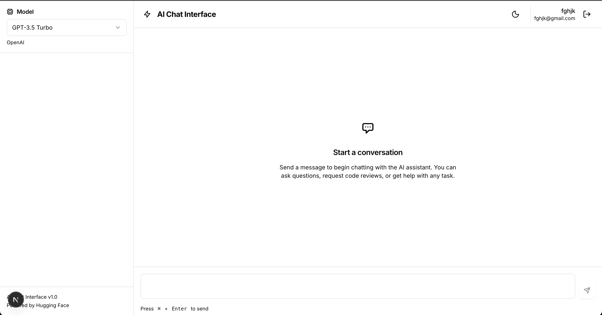
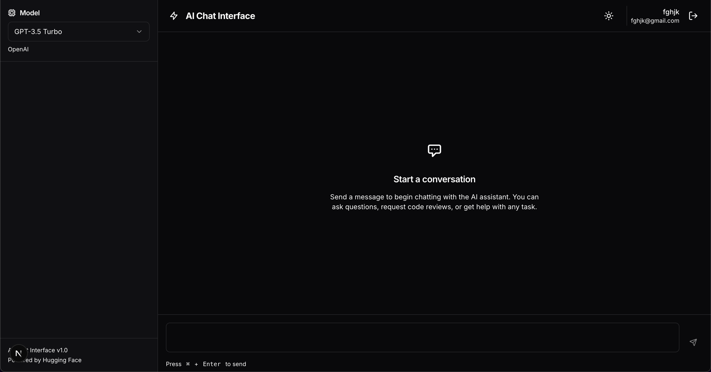
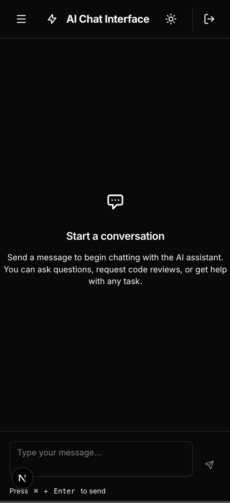
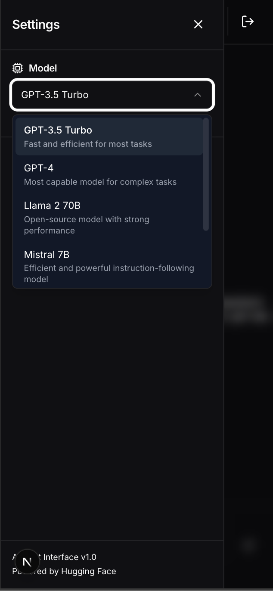

# AI Chat Interface

A polished, frontend-only prototype of an AI chat interface that combines the best features from leading AI platforms. Built with Next.js, React, TypeScript, and Tailwind CSS.

🔗 **Live Demo**: [Deploy your app and add URL here]

🔗 **GitHub Repository**: [Add your GitHub repository URL here]

📐 **Design Reference**: See [`DESIGN_SPEC.md`](./DESIGN_SPEC.md) for detailed design specifications and visual structure.

---

## Table of Contents

- [Research](#research)
- [Design](#design)
- [Development](#development)
- [Features](#features)
- [Tech Stack](#tech-stack)
- [Getting Started](#getting-started)
- [Storybook](#storybook)
- [Deployment](#deployment)
- [Known Limitations](#known-limitations)

---

## Research

### Platforms Reviewed

We analyzed 5 leading AI platforms to identify the most compelling features for our prototype:

#### 1. **OpenAI Playground**
A powerful interface for experimenting with GPT models, featuring real-time parameter tuning, system message configuration, and conversation history management with a clean, minimalist design.

**Standout Features:**
- Intuitive parameter controls (temperature, max tokens, top-p)
- Clean, distraction-free interface
- Real-time response streaming

#### 2. **Anthropic Claude**
Emphasizes safety and helpfulness with a conversational UI, artifact generation for code/documents, and a unique "thinking" visualization that shows the model's reasoning process.

**Standout Features:**
- Beautiful, modern UI with smooth animations
- Artifact system for code and documents
- Clear conversation threading

#### 3. **Hugging Face Spaces**
Community-driven platform showcasing diverse AI models with interactive demos, model cards with detailed information, and easy switching between different AI capabilities.

**Standout Features:**
- Model selection with detailed descriptions
- Wide variety of AI models
- Simple, accessible interface

#### 4. **Microsoft Copilot Lab**
Integrates AI assistance directly into workflows with contextual suggestions, code completion, and a sidebar interface that doesn't interrupt the main workspace.

**Standout Features:**
- Non-intrusive sidebar design
- Context-aware suggestions
- Professional, polished UI

#### 5. **Google AI Studio (Gemini)**
Features multimodal input support, structured prompt templates, parameter presets for different use cases, and export functionality for API integration.

**Standout Features:**
- Template management system
- Parameter presets
- Export/import functionality

### Selected Core Features

Based on our research, we implemented these **8 essential features**:

1. **Model Selector** - Dropdown to switch between AI models (GPT-3.5, GPT-4, Llama 2, Mistral, Claude, Gemini)
2. **Conversational Chat Interface** - Clean message bubbles with user/AI distinction, markdown support, and syntax highlighting
3. **Parameter Controls** - Sliders for temperature, max tokens, and top-p with real-time updates
4. **Prompt Templates** - Save, load, and manage reusable prompt templates
5. **Theme Toggle** - Beautiful light and dark modes with localStorage persistence
6. **Copy & Export** - Copy individual messages or download entire conversations as JSON
7. **Typing Indicators** - Visual feedback during AI response generation
8. **Authentication** - Login system with protected routes (mock implementation)

---

## Design

### Design Mockup Reference

**Design Approach**: This project was designed using a component-first approach, implementing the design directly in code with Tailwind CSS. The design specification and visual structure are documented in [`DESIGN_SPEC.md`](./DESIGN_SPEC.md).

**Visual Reference**: The live application serves as the interactive design mockup. Key screenshots:
### Screenshots

#### Light Mode


#### Dark Mode


#### Mobile View


#### Model Selector



**Design Tools**: While no separate Figma/XD file was created, the design system is fully documented with:
- Complete color palette and CSS variables
- Typography scale and font choices
- Spacing and layout specifications
- Component design decisions
- Responsive breakpoints

For detailed design specifications, see [`DESIGN_SPEC.md`](./DESIGN_SPEC.md).

### Design System

Our design system is built on a foundation of carefully chosen colors, typography, and spacing that work seamlessly in both light and dark modes.

#### Color Palette

**Light Mode:**
- Background: Pure white (#FFFFFF)
- Foreground: Dark gray (#0A0A0F)
- Primary: Vibrant blue (#3B82F6)
- Secondary: Light gray (#F5F5F5)
- Accent: Subtle gray (#E5E5E5)

**Dark Mode:**
- Background: Deep dark (#0A0A0F)
- Foreground: Off-white (#FAFAFA)
- Primary: Vibrant blue (#3B82F6) - consistent across themes
- Secondary: Dark gray (#1F1F23)
- Accent: Medium gray (#27272A)

#### Typography

- **Font Family**: Inter (Google Fonts) - A modern, highly legible sans-serif
- **Headings**: Semibold weight (600), tight tracking
- **Body**: Normal weight (400), relaxed leading
- **Code**: Monospace font with syntax highlighting

#### Spacing & Layout

- **Container Max Width**: 1400px
- **Sidebar Width**: 320px (collapsible on mobile)
- **Chat Max Width**: 800px (for optimal readability)
- **Border Radius**: 
  - Small: 8px (buttons, inputs)
  - Medium: 12px (cards)
  - Large: 16px (modals, major sections)

### Tailwind Mapping

Our design tokens are mapped to Tailwind CSS custom properties:

```css
/* Primary colors */
--primary: 221 83% 53%;           /* Blue accent */
--primary-foreground: 0 0% 98%;   /* White text on primary */

/* Background colors */
--background: 0 0% 100%;           /* Light mode background */
--foreground: 240 10% 3.9%;        /* Light mode text */

/* Component colors */
--card: 0 0% 100%;                 /* Card background */
--border: 240 5.9% 90%;            /* Border color */
--input: 240 5.9% 90%;             /* Input border */

/* Chat-specific */
--user-message: 221 83% 53%;       /* User message bubble */
--ai-message: 240 4.8% 95.9%;      /* AI message bubble */
```

### Component Design Decisions

#### 1. **Chat Bubbles**
- User messages: Right-aligned, primary color background
- AI messages: Left-aligned, secondary color background with border
- Both include: Avatar icon, timestamp, copy button (on hover)
- Markdown rendering with syntax-highlighted code blocks

**Tailwind Classes:**
```tsx
// User message
className="bg-[hsl(var(--user-message))] text-[hsl(var(--user-message-foreground))] rounded-2xl px-4 py-3"

// AI message  
className="bg-[hsl(var(--ai-message))] text-[hsl(var(--ai-message-foreground))] border border-border rounded-2xl px-4 py-3"
```

#### 2. **Sidebar**
- Fixed width on desktop (320px), full-screen overlay on mobile
- Collapsible sections for parameters and templates
- Smooth transitions using Tailwind's `transition-transform`

**Tailwind Classes:**
```tsx
className="w-80 bg-[hsl(var(--sidebar-bg))] border-r border-[hsl(var(--sidebar-border))]"
```

#### 3. **Buttons**
- Multiple variants using `class-variance-authority`
- Active scale animation (`active:scale-95`)
- Focus ring for accessibility

**Tailwind Classes:**
```tsx
className="rounded-lg px-4 py-2 transition-all focus-visible:ring-2 focus-visible:ring-ring active:scale-95"
```

#### 4. **Sliders**
- Custom styled range inputs with gradient fill
- Real-time value display
- Smooth thumb animations on hover

**Implementation:**
- Gradient background shows progress
- Custom thumb styling with `::webkit-slider-thumb`
- Min/max labels for context

#### 5. **Modal**
- Backdrop blur effect (`backdrop-blur-sm`)
- Framer Motion animations for smooth entry/exit
- ESC key and click-outside to close
- Focus trap for accessibility

**Tailwind Classes:**
```tsx
className="fixed inset-0 bg-background/80 backdrop-blur-sm"
```

### Responsive Design

**Breakpoints:**
- Mobile: < 768px (sidebar as overlay, stacked layout)
- Tablet: 768px - 1024px (sidebar visible, optimized spacing)
- Desktop: > 1024px (full layout with sidebar)

**Mobile Optimizations:**
- Hamburger menu for sidebar toggle
- Touch-friendly button sizes (min 44px)
- Optimized font sizes for readability
- Reduced padding for better space utilization

---

## Development

### Project Structure

```
my-app/
├── app/
│   ├── api/                    # Next.js API routes
│   │   ├── chat/route.ts       # Chat API endpoint
│   │   ├── models/route.ts     # Models API endpoint
│   │   └── templates/route.ts  # Templates API endpoint
│   ├── chat/page.tsx           # Main chat interface
│   ├── login/page.tsx          # Login page
│   ├── layout.tsx              # Root layout with providers
│   ├── page.tsx                # Landing page
│   └── globals.css             # Global styles & design tokens
├── components/
│   ├── auth/                   # Authentication components
│   │   ├── LoginForm.tsx
│   │   └── ProtectedRoute.tsx
│   ├── chat/                   # Chat-specific components
│   │   ├── ChatBubble.tsx
│   │   ├── ChatContainer.tsx
│   │   ├── MessageInput.tsx
│   │   └── TypingIndicator.tsx
│   ├── layout/                 # Layout components
│   │   ├── Header.tsx
│   │   └── Sidebar.tsx
│   ├── sidebar/                # Sidebar components
│   │   ├── ModelSelector.tsx
│   │   ├── ParametersPanel.tsx
│   │   └── TemplateManager.tsx
│   └── ui/                     # Reusable UI components
│       ├── Button.tsx
│       ├── Input.tsx
│       ├── Modal.tsx
│       ├── Select.tsx
│       ├── Slider.tsx
│       ├── Switch.tsx
│       └── Textarea.tsx
├── contexts/                   # React Context providers
│   ├── AuthContext.tsx
│   ├── ChatContext.tsx
│   └── ThemeContext.tsx
├── data/                       # Mock data
│   ├── models.json
│   └── templates.json
├── lib/                        # Utility functions
│   ├── constants.ts
│   ├── storage.ts
│   └── utils.ts
├── stories/                    # Storybook stories
│   ├── Button.stories.tsx
│   ├── ChatBubble.stories.tsx
│   ├── Modal.stories.tsx
│   └── Slider.stories.tsx
└── types/                      # TypeScript type definitions
    ├── auth.ts
    ├── chat.ts
    └── models.ts
```

### State Management

We use React Context API for global state management:

1. **ThemeContext** - Manages light/dark theme with localStorage persistence
2. **AuthContext** - Handles authentication state and mock login/logout
3. **ChatContext** - Manages chat messages, parameters, templates, and API calls

### API Integration

#### Mock API (Current Implementation)

The `/api/chat` route currently returns mock responses for demonstration purposes:

```typescript
// Mock response with random selection
const mockResponses = [
  "I'm a mock AI assistant...",
  "Here's an example of code...",
  // ... more responses
];
```

#### Real API Integration (Commented Code Included)

To integrate with Hugging Face Inference API:

1. Get a free API key from [Hugging Face](https://huggingface.co/settings/tokens)
2. Create `.env.local`:
   ```
   NEXT_PUBLIC_HF_API_KEY=your_api_key_here
   ```
3. Uncomment the real API code in `/app/api/chat/route.ts`

**Alternative Free APIs:**
- **Groq API**: Very fast inference, free tier available
- **Together AI**: Free trial credits
- **Replicate**: Pay-per-use with free credits

### Key Features Implementation

#### 1. Model Selector
- Fetches models from `/api/models`
- Displays model name, description, and provider
- Updates chat context when changed

#### 2. Parameter Controls
- Three sliders: Temperature (0-2), Max Tokens (1-4096), Top P (0-1)
- Real-time updates to chat context
- Persisted to localStorage

#### 3. Template Management
- CRUD operations for prompt templates
- Modal for creating new templates
- Load template into message input
- Persisted to localStorage

#### 4. Theme Toggle
- Detects system preference on first load
- Smooth transitions between themes
- Persists choice to localStorage
- Updates document class for Tailwind

#### 5. Message Export
- Download conversations as JSON
- Includes all messages and metadata
- Timestamped filename

### Accessibility Features

- **Keyboard Navigation**: All interactive elements are keyboard accessible
- **ARIA Labels**: Proper labeling for screen readers
- **Focus States**: Visible focus rings on all interactive elements
- **Semantic HTML**: Proper use of headings, buttons, and landmarks
- **Color Contrast**: WCAG AA compliant color combinations

### Performance Optimizations

- **Code Splitting**: Next.js automatic code splitting
- **Image Optimization**: Next.js Image component (if images added)
- **CSS-in-JS**: Tailwind CSS for minimal runtime overhead
- **Lazy Loading**: Components loaded on demand
- **Memoization**: React.memo and useMemo where appropriate

### Known Limitations

1. **No Real Backend**: Authentication and data use localStorage (not production-ready)
2. **Mock AI Responses**: Currently using mock data instead of real AI API
3. **No Conversation History**: Conversations are session-based, not persisted to database
4. **Single User**: No multi-user support or real-time collaboration
5. **API Rate Limits**: Free tier APIs have rate limits (e.g., Hugging Face: 30 req/min)
6. **Node Version**: Storybook requires Node 20+, but the app works with Node 18+

---

## Features

✅ **Model Selection** - Choose from 6 different AI models  
✅ **Parameter Controls** - Fine-tune temperature, max tokens, and top-p  
✅ **Prompt Templates** - Save and reuse your favorite prompts  
✅ **Dark Mode** - Beautiful light and dark themes  
✅ **Markdown Support** - Rich text formatting in messages  
✅ **Code Highlighting** - Syntax highlighting for code blocks  
✅ **Copy to Clipboard** - Copy individual messages  
✅ **Export Conversations** - Download chat history as JSON  
✅ **Typing Indicators** - Visual feedback during AI responses  
✅ **Responsive Design** - Works on mobile, tablet, and desktop  
✅ **Keyboard Shortcuts** - Cmd/Ctrl+Enter to send messages  
✅ **Authentication** - Mock login system with protected routes  

---

## Tech Stack

- **Framework**: Next.js 16 (App Router)
- **UI Library**: React 19
- **Language**: TypeScript (strict mode)
- **Styling**: Tailwind CSS 4
- **Animations**: Framer Motion
- **Icons**: Lucide React
- **Markdown**: react-markdown + remark-gfm
- **Code Highlighting**: react-syntax-highlighter
- **Component Variants**: class-variance-authority
- **Development**: Storybook (requires Node 20+)

---

## Getting Started

### Prerequisites

- Node.js 18+ (Node 20+ required for Storybook)
- npm or yarn

### Installation

1. Clone the repository:
   ```bash
   git clone [your-repo-url]
   cd my-app
   ```

2. Install dependencies:
   ```bash
   npm install
   ```

3. Run the development server:
   ```bash
   npm run dev
   ```

4. Open [http://localhost:3000](http://localhost:3000) in your browser

### Environment Variables (Optional)

For real AI API integration, create `.env.local`:

```env
NEXT_PUBLIC_HF_API_KEY=your_hugging_face_api_key
```

---

## Storybook

**Note**: Storybook requires Node.js 20+. If you're using Node 18, you'll need to upgrade to run Storybook.

### Running Storybook

```bash
npm run storybook
```

### Available Stories

- **Button** - All button variants and states
- **Slider** - Parameter sliders with different ranges
- **Modal** - Modal dialogs with various sizes
- **ChatBubble** - Message bubbles with markdown and code

---

## Deployment

### Deploy to Vercel (Recommended)

1. Push your code to GitHub
2. Import project to [Vercel](https://vercel.com)
3. Configure environment variables (if using real API)
4. Deploy!

### Deploy to Netlify

1. Build the project:
   ```bash
   npm run build
   ```

2. Deploy the `.next` folder to Netlify

### Deploy to GitHub Pages

1. Install `gh-pages`:
   ```bash
   npm install --save-dev gh-pages
   ```

2. Add to `package.json`:
   ```json
   "scripts": {
     "deploy": "next build && next export && gh-pages -d out"
   }
   ```

3. Deploy:
   ```bash
   npm run deploy
   ```

---

## License

MIT License - feel free to use this project for learning and development.

---

## Acknowledgments

- Design inspiration from OpenAI, Anthropic, Hugging Face, Microsoft, and Google
- Built as a prototype for educational purposes
- Special thanks to the Next.js and React communities

---

**Built with ❤️ using Next.js, React, and Tailwind CSS**

# AI-Chatbot-web
# AI_chatbot
